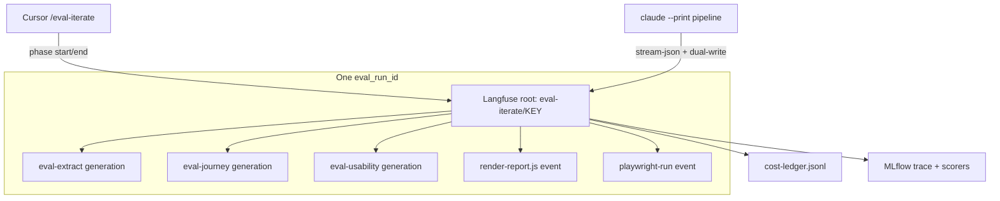

# End-to-end observability plan — 3 MR corpus

**Status:** Draft for review  
**Corpus:** RHAISTRAT-1492 (MR 170), RHAISTRAT-1527 (MR 168), RHAISTRAT-133 (MR 169)  
**Tied to:** Langfuse hybrid plan CP0–CP5, success gate ≥40% `llm_cost_usd` reduction with no quality regression

---

## 1. Goals (unchanged from project start)

| Goal | How we prove it |
|------|-----------------|
| See **full pipeline cost** per run | `cost-ledger.jsonl` + Langfuse trace totals |
| See **tokens/cost by phase** (not one blob) | Langfuse child spans per `eval-*` phase + generation observations |
| See **artifact generation cost** (non-LLM) | Langfuse events: `render-report.js`, `playwright-run`, `validate-artifact-schemas` with `duration_ms` + `output_bytes`, `llm_cost_usd: 0` |
| Compare **CLI vs Cursor** runs | `invocation: cli \| cursor` on every trace |
| Run **3 MRs** with same dimensions | Repeat golden + matrix per key |
| **Cheaper models** without breaking AC/usability | Subskill probes → full pipeline only after per-phase sign-off |
| **Cursor thought process** for review | Phase spans + optional transcript link (metadata only) |

**Privacy:** metadata-only — no Jira body, screenshots, or report HTML in Langfuse.

---

## 2. What to track (data model)

### 2.1 Run envelope (one per `/eval-iterate` or `/uxd-prototype-evaluate`)

| Field | Source | Langfuse | Ledger |
|-------|--------|----------|--------|
| `eval_run_id` | `eval-state.yaml` | `trace_id` (derived hash) + metadata | row key |
| `prototype_key` | CLI arg | metadata | ✓ |
| `experiment` | e.g. `golden-a-opus-nofix`, `matrix-f-nf` | metadata | ✓ |
| `run_mode` | `fresh` \| `incremental` | metadata | ✓ |
| `fix_mode` | `no_fix` \| `iterate` | metadata | ✓ |
| `model_tier` | premium / standard / budget | metadata | ✓ |
| `invocation` | `cli` \| `cursor` | metadata | ✓ |
| `iterate_flags` | raw flags string | metadata | ✓ |
| `llm_cost_usd` | CLI stream-json | root span + scores | `totals.llm_cost_usd` |
| `observability_cost_usd` | env estimate | metadata | `totals.observability_cost_usd` |
| `langfuse_trace_url` | SDK | — | ✓ |
| `mlflow_run_id` | pipeline | tag (optional) | ✓ |

### 2.2 Phase layer (orchestrator steps)

Each row is a **child span** under root `eval-iterate/{KEY}`:

| Phase | Default model | Track |
|-------|---------------|-------|
| `eval-extract` | Sonnet | input/output tokens, `llm_cost_usd`, duration |
| `eval-classify` | Sonnet | same |
| `eval-consistency-source` | Opus | same |
| `eval-journey` | Opus | same + `playwright-run` event |
| `eval-fix` | Opus | same (iterate only) |
| `eval-consistency-visual` | Opus | same |
| `eval-usability` | Opus | same + persona id hash |
| `eval-report` | Sonnet | same |
| `render-report.js` | — | **event:** `duration_ms`, `output_bytes`, cost 0 |
| `validate-artifact-schemas` | — | **event:** pass/fail counts |
| `playwright-run` | — | **event:** duration, screenshot count |

**Gap today:** CLI `mlflow-trace-pipeline` logs one `generation/claude-opus-4-6` blob + `render-report.js`. Per-phase breakdown requires orchestrator hooks (see §4).

### 2.3 Quality layer (for cost/quality tradeoffs)

| Metric | Langfuse | MLflow scorers |
|--------|----------|----------------|
| `ac_pass_rate` | score on trace | eval-journey |
| `ac_fail` / `ac_flagged` | metadata | ledger from artifacts |
| `usability_score` | score | eval-usability |
| `golden_verdict` | metadata | human sign-off |

### 2.4 Cursor “thought process” (what we can and cannot store)

| Capturable in Langfuse | Not stored (privacy / volume) |
|------------------------|-------------------------------|
| Phase start/end timestamps | Full agent reasoning text |
| Phase name + `eval_run_id` | Screenshot bytes |
| Link to local transcript path | Raw Jira content |
| Tool call **counts** per phase (optional) | Full tool I/O |

**Recommendation:** Store `cursor_transcript_ref` in metadata (path or session id hash), not the transcript body. Review thought process in Cursor UI; use Langfuse for **when** and **how much** each phase cost.

---

## 3. How it is tracked (by path)



### Path A — CLI (authoritative $)

```bash
eval "$(make langfuse-local-env)"
eval "$(make mlflow-poc7)"
make mlflow-pipeline KEY=RHAISTRAT-1492 URL=http://localhost:9000 \
  ITERATE_FLAGS="--fresh --no-fix --max-iterations=1" EXPERIMENT=golden-a-opus-nofix
```

- **Cost authority:** `claude --print` stream-json → `llm_cost_usd`
- **Langfuse:** `mlflow-trace-pipeline.py` → `langfuse_trace.log_pipeline_run`
- **Ledger:** `log-cost-ledger.js` appended per run
- **MLflow:** orchestrator trace + `mlflow-trace-eval.py` scorers

### Path B — Cursor (authoritative workflow, coarse $)

Orchestrator follows `orchestration.md`:

```bash
python3 scripts/langfuse_trace.py phase \
  --artifacts-dir "$ARTIFACTS_DIR" --phase eval-journey --action start
# ... run phase ...
python3 scripts/langfuse_trace.py phase \
  --artifacts-dir "$ARTIFACTS_DIR" --phase eval-journey --action end --duration-ms N
```

- Same `eval_run_id` in `eval-state.yaml` before any phase
- `invocation: cursor` on all spans
- No per-token $ unless user runs subskill via CLI compare

### Path C — Langfuse Cursor plugin (review, not ingest)

After runs:

```bash
eval "$(make langfuse-local-env)"
npx langfuse-cli api observations list --limit 50 --json
```

In Cursor chat: *"Use Langfuse skill — compare matrix-f-it vs matrix-i-it by metadata.run_mode"*

---

## 4. Implementation phases (work remaining)

### CP-E2E-1 — Per-phase CLI instrumentation (highest value)

**Problem:** Pipeline trace collapses to one generation; can't see journey vs usability cost.

**Fix:**

1. After each Task/subskill in orchestrator, parse subskill `run_result` or stream capture → `langfuse_trace.py log-pipeline` phase entry
2. Or: wrap each subskill CLI with `mlflow-compare-models.py --langfuse` pattern (one skill at a time)
3. Extend `_build_phases_from_usage` to read per-phase token files if subskills write them

**Verify:** Langfuse trace shows ≥8 named children for a full no-fix run.

### CP-E2E-2 — Three-MR rollout

| MR | Golden A/B | Matrix 4-cell | When |
|----|------------|---------------|------|
| RHAISTRAT-1492 | ✓ done | ✓ done | now |
| RHAISTRAT-1527 | pending | pending | after CP-E2E-1 on 1492 |
| RHAISTRAT-133 | pending | pending | after 1527 |

Requires artifacts/workspace per key (clone + `npm run start:dev` or shared URL strategy).

### CP-E2E-3 — Cursor transcript linking

1. On pipeline start: write `eval-state.yaml` field `cursor_session_id` or transcript path
2. Langfuse root metadata: `cursor_transcript_ref` (hash or file path)
3. Document: open transcript in Cursor for reasoning; Langfuse for cost timeline

### CP-E2E-4 — Dashboards (Langfuse UI)

Build saved views / filters:

- Cost by `metadata.experiment`
- Cost by `metadata.run_mode` × `metadata.fix_mode`
- Cost by phase name (generation children)
- Artifact bytes: sum `output_bytes` on `render-report.js` events

---

## 5. Should we test individual subskills?

**Yes — do this before more full-pipeline Opus runs.** Aligns with Phase 4 and cursor-efficiency (isolate variables).

| Approach | Command | Purpose |
|----------|---------|---------|
| **Fixture tests** | `make test-subskills KEY=RHAISTRAT-1492` | Schema/contract, no $ |
| **Single-skill LLM probe** | `make mlflow-compare KEY=… URL=… LANGFUSE=1 SKILLS=eval-extract MODELS=claude-haiku-4-5` | Cost + quality for one phase |
| **Recommended matrix** | extract, classify → Haiku/Sonnet; journey, usability → Sonnet/Opus | Find downgrade candidates |

**Order:**

1. Subskill probes on **RHAISTRAT-1492** only (cheapest signal)
2. Promote winning model per phase to full pipeline
3. Re-run golden on all 3 MRs only after ≥40% savings hypothesis holds on 1492

**Do not** change model + run_mode in the same experiment day.

---

## 6. Review checklist (for you)

After each corpus key:

- [ ] Root trace in Langfuse with correct `eval_run_id`, `run_mode`, `fix_mode`
- [ ] Ledger row matches trace URL
- [ ] Per-phase costs visible (or documented gap)
- [ ] `render-report.js` shows `output_bytes` (artifact size trend)
- [ ] MLflow scorers ≥ golden quality bar
- [ ] Cursor run: phase spans present if invoked from IDE

**Local UI:** http://localhost:3000/project/uxd-eval-local/traces  
**Review guide:** [langfuse-benchmark-review.md](langfuse-benchmark-review.md)

---

## 7. Immediate next actions

1. **You:** Review benchmark traces in Langfuse (4 matrix + 2 golden)
2. **Implement CP-E2E-1:** per-phase Langfuse children from orchestrator
3. **Run subskill matrix** on RHAISTRAT-1492 (`mlflow-compare` + `LANGFUSE=1`, one skill per invocation)
4. **Golden on RHAISTRAT-1527** once artifacts exist
5. **Defer cluster Langfuse** until local E2E model is stable
